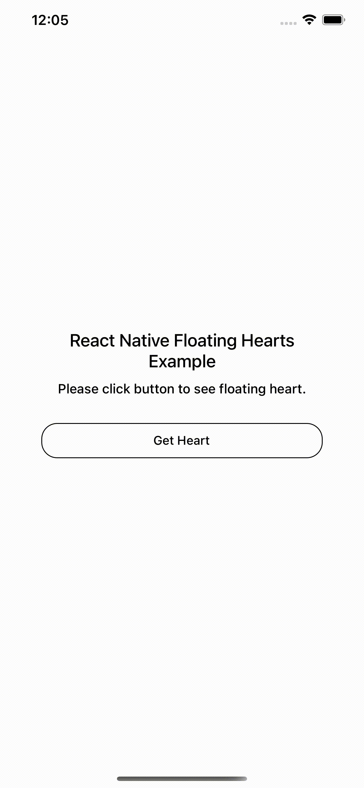

# react-native-floating-heart

A simple and fully customizable React Native component that implement a floating hearts.
* Fully customizable heart icon.


React Native Floating Hearts Example
:-------------------------:



## Installation

If using yarn:

```
yarn add react-native-floating-heart
```

If using npm:

```
npm i react-native-floating-heart
```

## Usage

```
import { FloatingHeart } from 'react-native-floating-heart';
```

Simply place a `<FloatingHeart />` tag.

```
const [heartCount, setHeartCount] = useState(0);

const addHeart = () => {
  let newCount = heartCount + 1;
  setHeartCount(newCount++);
}

return <View style={styles.container}>
  <Text style={[styles.description, { fontSize: 20 }]}>React Native Floating Hearts Example</Text>
  <Text style={styles.description}>Please click button to see floating heart.</Text>
  <FloatingHeart count={heartCount}/>
  <TouchableOpacity style={{ width: 320, height: 40, borderWidth: 1, borderColor: '#000', borderRadius: 18, marginTop: 20, alignItems: 'center', justifyContent: 'center' }} onPress={addHeart}>
    <Text style={{ fontWeight: '500' }}>Get Heart</Text>
  </TouchableOpacity>
</View>;
```

### Change Heart Icon
Heart Icon is fully customizable using the `renderCustomIcon` props.

```
const [heartCount, setHeartCount] = useState(0);

const renderStar = () => (
  <Icon name="star" size={30} style={{ color: 'pink' }} />
)

const addHeart = () => {
  let newCount = heartCount + 1;
  setHeartCount(newCount++);
}

return <View style={styles.container}>
  <Text style={[styles.description, { fontSize: 20 }]}>React Native Metamask Phrase Word Example</Text>
  <Text style={styles.description}>Select each word in the order it was presented to you.</Text>
  <FloatingHeart count={heartCount} renderCustomIcon={renderStar}/>
  <TouchableOpacity style={{ width: 320, height: 40, borderWidth: 1, borderColor: '#000', borderRadius: 18, marginTop: 20, alignItems: 'center', justifyContent: 'center' }} onPress={addHeart}>
    <Text style={{ fontWeight: '500' }}>Complete Backup</Text>
  </TouchableOpacity>
</View>;
```

## Documentation

### Floating Heart Component
| Name                      | Description                              | Default     | Type    |
|---------------------------|------------------------------------------|-------------|---------|
| count                     | Number of hearts                         | REQUIRED    | number  |
| color                     | Color of heart icon                      | pink        | string  |
| renderCustomIcon          | Render a custom image/icon instead of heart  |         | function |
| style                     | The container style of component         | null        | Object  |
| heartStyle                | The heart style                          | null        | Object  |

## Contributing
Pull requests are always welcome! Feel free to open a new GitHub issue for any changes that can be made.

## Author
Huy Pham

## License
[MIT](./LICENSE)